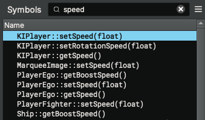
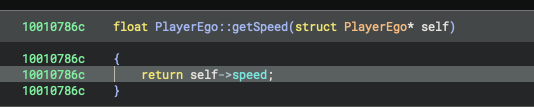
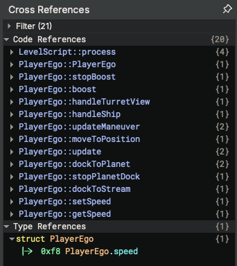
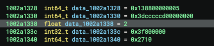

# FasterShips

Hello, we are going to take a look as to how one can speed up their ships on Galaxy on Fire 2.

To understand this, you will just need some basic reverse engineering knowledge.

## iOS

After loading the iOS binary inside of Binary Ninja and filtering the symbols for `speed`, here are the results :

I immediatly notice the getters and setters for speed of `KIPlayer` and `PlayerEgo`. However, the functions of `KIPlayer` do not have a any xrefs, so we'll just ignore them.

We can see the `speed` field of `PlayerEgo`. Now, let's take a look at its xrefs.

All of the xrefs seems normal, the only one that caught my eye is `PlayerEgo::PlayerEgo`, this is the constructor, it must set a default value.
```asm
adrp x8, 0x1002a1000 ; loads page 0x1002a1000 into register x8
ldr d0, [x8, #0x338] ; stores in d0 the value at x8 + 0x338 (0x1002a1000+0x338=0x1002a1338)
str d0, [x19, #0xf8] ; writes d0 at x19 (PlayerEgo instance base address) offsetted by 0xf8 (speed float offset)
```
This assembly code means the base speed is stored at `0x1002a1338`. Let's check this!

Yes, it is indeed, the base speed is 2.0f!
So I wrote a tiny tweak to change the speed, check it out [here](../FasterShips/Tweak.m).

## Android
On android, I used the same approach, however the base speed isn't stored in a data segment but rather in assembly itself.
```asm
mov r1, #0x40000000         ; stores 0x40000000 into r1
strd r1, r10, [r4, #0xb8]   ; writes r1 into r4 offsetted by 0xb8 (speed float offset)
```

Like on iOS, the base speed is 2.0f. I will update this guide soon with a way to change the value associated using bitwise operations.
