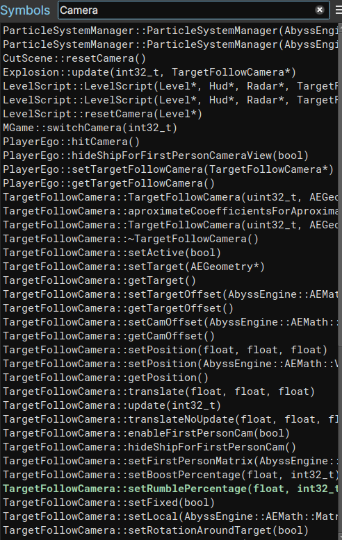
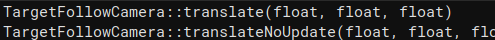
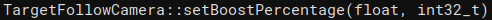
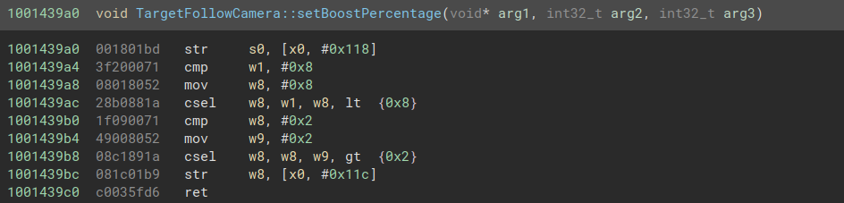
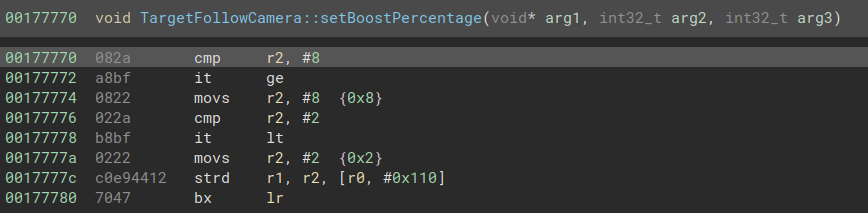

# NoScreenShake

Welcome to my write-up about how to patch the game to remove this shake effect.

Everyone should be able to understand this, tho, basic reverse engineering will be useful !

First of all searching "Camera" in the symbols I can find a bunch of functions. 

One class looks really interesting, `TargetFollowCamera`, I can see a lot of methods related to the player's camera which probably holds something interesting for this case.
Digging into those function, I find two which contains the word `translate`.


So I decided to hook the `translate(float, float, float)` function and see what it does.
Here is the code : 
```objc
%hookf(void, target, float x, y, z) {
    %orig(0, 0, 0);
}
```

It didn't work, after some more digging, I saw the `setBoostPercentage(float, int)` which was exactly what I was trying to achieve. 


I then wrote something to hook that.

```objc
%hookf(void, target, float x, int y) {
    %orig(0.0f, 0);
}
```

The game crashed, pretty odd.

After a bit of testing, I ended up with a working code : 
```objc
%hookf(void, target, float x, int y) {
    // %orig;
}
```

Simply not calling the original function, which worked !

However, it was not the first time I experienced a crash when hooking setter. And after searching a bit, thanks @Leptos, who told me I was forgetting the instance parameter.



Yes, obviously, I originally thought the `void *` pointer was an issue with the decomp, but no it was the instance.

After adding it to my code :

```objc
%hookf(void, target, void *self,float x, int y) {
    %orig(self, 0.0f, 0);
}
```

It finally works !

## Android

Now, I can try and patch android. After opening the `libgof2hdaa.so`. I immediatly opened the `setBoostPercentage(float, int)`. Switched to the disassembly view and got this.



To patch the android version, I started by replacing the opcodes in that function by simply `bx lr`, which simply returns to the caller function.

I exported the resulting shared library and tested it... It worked !